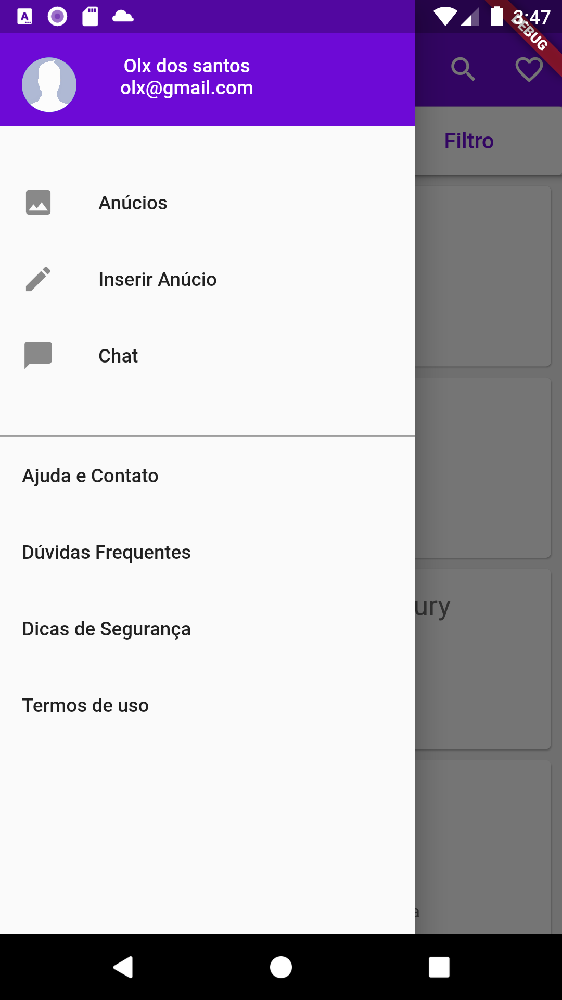
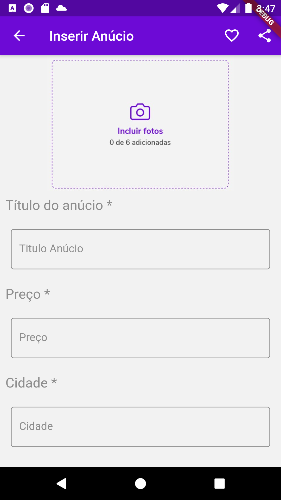

# Clone OLX

Oprojeto conciste em um clone do App OLX com algumas das principais funcionalidades,implementado em FLutter para ndroid e IOS

## Getting Started

Projeto pronto para Rodar, necessario apenas o SDK do flutter instalado

### Prerequisites

Para Rodar o projeto é necessario ter o SDK flutter Instalador

### Installing

 O projeto esta rodando nas segintes especificações:
 
Flutter 1.12.13+hotfix.5 • channel stable • https://github.com/flutter/flutter.git
Framework • revision 27321ebbad (7 months ago) • 2019-12-10 18:15:01 -0800
Engine • revision 2994f7e1e6
Tools • Dart 2.7.0

## Running the tests

Tela inicial com os anuncios adicionados 

Tela Detalhes do anicio selecionado

Navigation Drawer com informações do usuario e algumas opções

Tela com Form para adicionar o anuncio

## Deployment

Falta algumas implementações pendentes porem o projeto é so para fins de conhecimento, 

## Built With

* [Flutter 1.12.13+hotfix.5 
* Dart 2.7.0
## Authors

* **Roberto Chaves Souza** - *Initial work* - [robertcsouza](https://github.com/robertcsouza)

## License

This project is licensed under the MIT License - see the [LICENSE.md](LICENSE.md) file for details

